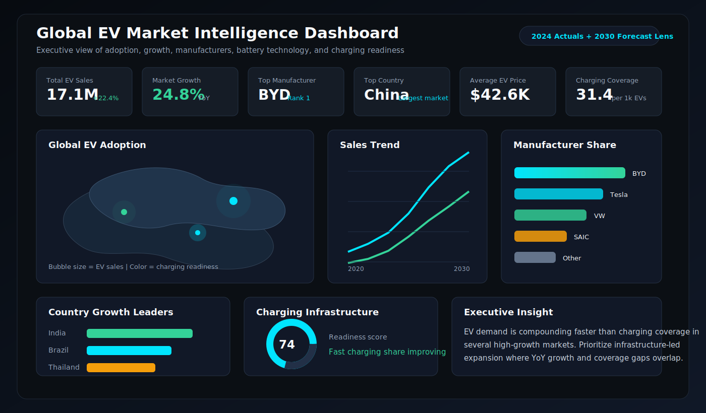

# Global EV Market Intelligence Dashboard




## Executive Summary

**Global EV Market Intelligence Dashboard** is a recruiter-grade Power BI portfolio project designed to answer one question a C-level stakeholder actually cares about:

> Where is the electric vehicle market growing fastest, who is winning share, and how ready is charging infrastructure to support the next wave of adoption?

This project combines global EV market indicators from the International Energy Agency with a large record-level EV population dataset from Washington State Department of Licensing. The result is an executive analytics experience covering EV adoption, manufacturer performance, battery technology, charging coverage, market growth, and forecast scenarios.

The dashboard is built for a Data Analyst portfolio: clean data modeling, strong DAX, Power Query transformation logic, drill-through pages, bookmarks, modern dark UI, and business-first storytelling.

## Portfolio Impact

This project is designed to show hiring managers that you can move beyond basic charts and deliver a full business intelligence product:

- Executive KPI design
- Real-world data sourcing
- 50,000+ record data cleaning workflow
- Star schema data modeling
- Advanced DAX
- Forecasting and market intelligence
- Drill-through reporting
- Bookmark-driven navigation
- Professional GitHub documentation

## Business Problem

EV adoption is no longer a niche sustainability metric. It affects revenue planning, charging infrastructure investment, battery supply chains, government policy, and manufacturer strategy. Executives need a single intelligence layer that connects market demand, technology mix, geography, and infrastructure readiness.

This dashboard helps stakeholders:

- Identify the countries and manufacturers leading EV adoption.
- Quantify year-over-year growth and long-term CAGR.
- Compare BEV and PHEV market dynamics.
- Monitor charging station coverage relative to EV stock.
- Understand whether market growth is supported by infrastructure.
- Spot high-growth markets for expansion, partnerships, or investment.

## Dataset Description

### Primary Global Dataset

**Source:** [International Energy Agency - Global EV Data Explorer](https://www.iea.org/data-and-statistics/data-tools/global-ev-data-explorer?os=f)  
**License:** CC BY 4.0  
**Coverage:** Historical and projected EV sales, EV stock, charging infrastructure, powertrain, region, country, and scenario data.  
**Use in Project:** Global map, country growth, EV sales trend, charging infrastructure dashboard, forecast analysis, CAGR, market growth, and charging coverage metrics.

### Large Record-Level Dataset

**Source:** [Washington State Electric Vehicle Population Data](https://data.wa.gov/Transportation/Electric-Vehicle-Population-Data/f6w7-q2d2)  
**Provider:** Washington State Department of Licensing  
**Latest verified metadata:** Updated May 13, 2026; registrations as of April 30, 2026.  
**Scale:** 285,822 local records downloaded for this project, exceeding the 50,000+ record requirement.  
**Use in Project:** Manufacturer ranking, model-level analysis, vehicle type segmentation, electric range profiling, base MSRP analysis, geographic density, and record-level Power Query cleaning.

See [`docs/dataset_profile.md`](docs/dataset_profile.md) for the generated dataset profile.

### Optional Enrichment Tables

- ISO country and region mapping table.
- Manufacturer parent group mapping.
- Battery chemistry lookup table.
- Charging type lookup table.
- Currency and average price normalization table.

## Power BI File Structure

```text
Global-EV-Market-Intelligence-Dashboard/
|-- README.md
|-- assets/
|   `-- dashboard-preview.svg
|-- data/
|   `-- README.md
|-- docs/
|   |-- build_steps.md
|   |-- dashboard_layout_plan.md
|   |-- dataset_profile.md
|   |-- data_model_design.md
|   |-- github_push_checklist.md
|   `-- drillthrough_bookmarks.md
`-- powerbi/
    |-- DAX_Measures.dax
    |-- EV_Dark_Executive_Theme.json
    |-- Global_EV_Market_Intelligence_Dashboard.pbix.placeholder
    `-- Power_Query_Transformations.pq
```

## KPIs

| KPI | Business Meaning |
|---|---|
| Total EV Sales | Total EV units sold across selected markets and years |
| Market Growth % | YoY growth rate for EV sales |
| Top Manufacturer | Highest-ranked manufacturer by EV registrations or sales |
| Top Country | Country with the highest selected EV sales, stock, or adoption |
| Average EV Price | Average MSRP or estimated market price across available vehicle records |
| Charging Station Coverage | Public charging points per EV stock, scaled per 1,000 EVs |

## Dashboard Pages

### 1. Executive Overview

Dark executive landing page with KPI cards, global adoption map, sales trend, manufacturer share, and an insight panel summarizing the selected market.

### 2. Market Growth Intelligence

Country-wise YoY growth, CAGR, EV sales share, powertrain split, and high-growth market ranking.

### 3. Manufacturer & Model Performance

Manufacturer market share, ranking, revenue contribution, average price, model mix, and drill-through by manufacturer.

### 4. Battery & Vehicle Technology

BEV vs PHEV comparison, electric range distribution, battery technology assumptions, model year evolution, and price-to-range analysis.

### 5. Charging Infrastructure

Public charging points, fast vs slow charger mix, charging coverage, infrastructure gap analysis, and charging readiness score.

### 6. Forecasting & Scenario Analysis

Forecasted EV adoption through 2030 using IEA scenarios, historical growth bands, CAGR benchmarks, and market saturation signals.

## Core DAX Measures

The complete measure library is available in [`powerbi/DAX_Measures.dax`](powerbi/DAX_Measures.dax).

```DAX
YoY Growth % =
VAR CurrentSales = [Total EV Sales]
VAR PreviousSales =
    CALCULATE(
        [Total EV Sales],
        DATEADD('Dim Date'[Date], -1, YEAR)
    )
RETURN
DIVIDE(CurrentSales - PreviousSales, PreviousSales)
```

```DAX
Market Share % =
DIVIDE(
    [Total EV Sales],
    CALCULATE([Total EV Sales], ALL('Dim Manufacturer'))
)
```

```DAX
CAGR =
VAR FirstYear = MIN('Dim Date'[Year])
VAR LastYear = MAX('Dim Date'[Year])
VAR FirstSales =
    CALCULATE([Total EV Sales], 'Dim Date'[Year] = FirstYear)
VAR LastSales =
    CALCULATE([Total EV Sales], 'Dim Date'[Year] = LastYear)
VAR YearCount = LastYear - FirstYear
RETURN
IF(YearCount > 0, POWER(DIVIDE(LastSales, FirstSales), 1 / YearCount) - 1)
```

## Key Insights This Dashboard Is Designed to Surface

- EV adoption is highly concentrated in a small number of large markets, but growth opportunities often appear first in mid-size markets with accelerating YoY rates.
- Manufacturer leadership changes depending on whether the metric is registrations, sales, revenue contribution, or model breadth.
- BEV growth generally signals stronger long-term electrification maturity than PHEV growth, but PHEV-heavy markets can indicate transition-stage consumer behavior.
- Charging coverage should be evaluated relative to EV stock, not just total charger count.
- Infrastructure gaps are most visible when EV stock rises faster than charging point deployment.

## Dashboard Design Direction

**Theme:** Executive dark mode  
**Palette:** Carbon black, graphite, electric cyan, neon green, cool white  
**Visual Style:** Minimal grid, high-contrast cards, map-led geography, thin dividers, subtle glow only on selected KPIs  
**Audience:** C-suite leaders, strategy teams, market intelligence analysts, sustainability teams, and automotive business units

Import the Power BI theme from [`powerbi/EV_Dark_Executive_Theme.json`](powerbi/EV_Dark_Executive_Theme.json).

## Drill-Through Functionality

Implemented drill-through pages:

- Country Detail
- Manufacturer Detail
- Battery Technology Detail
- Charging Infrastructure Detail

Each page passes context from the main dashboard and exposes deeper market composition, growth, rank, and infrastructure metrics.

## Bookmarks & Navigation

Bookmark states:

- Executive Summary
- Growth Lens
- Manufacturer Lens
- Infrastructure Lens
- Forecast Lens
- Reset Filters

Navigation buttons use Power BI bookmark actions, page navigation, and a persistent top navigation bar for a polished app-like experience.

## Power Query Transformation Highlights

Power Query cleaning logic includes:

- Standardized country, region, manufacturer, and powertrain names.
- Removed duplicate registration rows using VIN-derived identifiers where available.
- Converted year, date, sales, stock, MSRP, electric range, and charging counts to typed columns.
- Created clean BEV/PHEV classifications.
- Split geographic fields into city, county, state, country, latitude, and longitude.
- Built country-region mapping and manufacturer parent group dimensions.
- Created analysis-ready fact tables for EV sales, EV stock, charging infrastructure, and vehicle registrations.

See [`powerbi/Power_Query_Transformations.pq`](powerbi/Power_Query_Transformations.pq).

## How to Build the PBIX

Follow the implementation workflow in [`docs/build_steps.md`](docs/build_steps.md).

High-level flow:

1. Download the source CSV files into `data/raw`.
2. Load the CSVs into Power BI Desktop.
3. Apply the Power Query transformation logic.
4. Create the star schema relationships.
5. Add the DAX measures into a dedicated `_Measures` table.
6. Build the six report pages using the layout plan.
7. Add drill-through pages, bookmarks, and navigation buttons.
8. Export dashboard screenshots into `assets/screenshots`.

## Data Model

The model uses a star schema:

- `Fact EV Sales`
- `Fact EV Stock`
- `Fact Charging Infrastructure`
- `Fact Vehicle Registrations`
- `Dim Date`
- `Dim Country`
- `Dim Manufacturer`
- `Dim Vehicle`
- `Dim Powertrain`
- `Dim Scenario`

See [`docs/data_model_design.md`](docs/data_model_design.md).

## Dashboard Screenshots

The included preview asset shows the intended executive design direction:


When building the final `.pbix`, export screenshots from Power BI Desktop into:

```text
assets/screenshots/
|-- 01_executive_overview.png
|-- 02_market_growth.png
|-- 03_manufacturer_detail.png
|-- 04_charging_infrastructure.png
`-- 05_forecast_analysis.png
```

## Future Improvements

- Add live API refresh using an automated dataflow.
- Add country-level policy incentives and subsidy data.
- Integrate battery mineral supply chain indicators.
- Add model-level pricing by region.
- Publish to Power BI Service with scheduled refresh.
- Add role-level security for region-specific executive views.
- Add decomposition tree and key influencers visuals for adoption drivers.

## Recruiter Notes

This project demonstrates:

- Business framing and stakeholder-ready dashboard design.
- Power Query cleaning and data shaping.
- Dimensional modeling with fact and dimension tables.
- Advanced DAX for growth, share, ranking, CAGR, and running totals.
- Drill-through, bookmarks, navigation, and executive storytelling.
- Documentation quality suitable for a professional analytics portfolio.

## Tech Stack

- Power BI Desktop
- Power Query
- DAX
- CSV / open data sources
- GitHub documentation
- Optional Power BI Service deployment

## Suggested Repository Topics

`power-bi` `data-analytics` `ev-market` `dashboard` `dax` `power-query` `business-intelligence` `portfolio-project` `data-visualization`

## GitHub Push Readiness

Use [`docs/github_push_checklist.md`](docs/github_push_checklist.md) before publishing the repository.

The only final artifact that must be created inside Power BI Desktop is:

```text
powerbi/Global_EV_Market_Intelligence_Dashboard.pbix
```

All supporting documentation, DAX, Power Query, theme, data profile, and repository structure are included.
